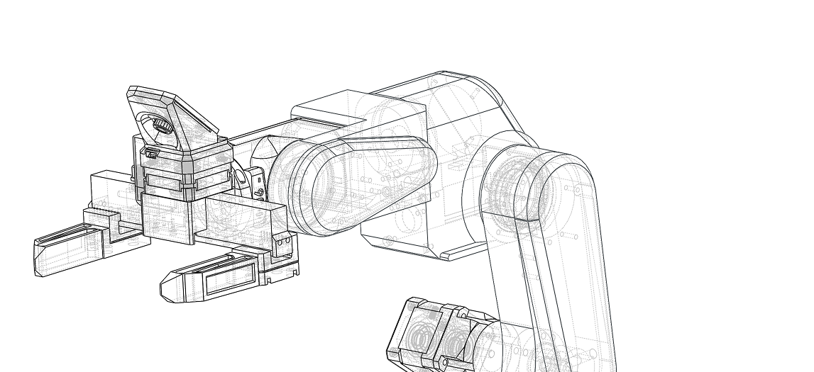

> [!CAUTION]
> This is a BETA release: Instructions, code, and 3D print files may change in the future and are not yet finalized.

By building and using this system, you acknowledge that it is still under active development and may contain errors, incomplete features, or design issues. You are doing so entirely at your own risk and responsibility.

This project may require troubleshooting, modifications, and technical knowledge. Proceed only if you are comfortable working with electronics, mechanical systems, and software in a development-stage environment.
>

## 🐞 Beta Feedback

Since this project is currently in beta, feedback is highly appreciated.

If you find any mistakes, bugs, or unclear parts, please report them, including issues in:

- Documentation
- BOM and assembly documentation
- Source code
- STL and other 3D print files

Please open an issue, send us a message on Discord, or contact us via email with as much detail as possible so we can fix it quickly.

# PAR6-Collaborative-Robot-Arm

---

  
  
  
  
  

  
  
  
  
  
  

3D Printed Collaborative Robot - Open Source Software, Manuals & 3D print files ·

Designed for Embodied/Physical  AI, Safety & Ease of use

## 💡 News

[2025-04-10] Test

[2025-04-03] Beta Release! Contributions from the open-source community are highly encouraged, and we welcome feedback and bug reports through the GitHub Issues page.

## 📖 Project Overview

PAR6 is a 3D-printed collaborative robot arm platform designed for research, education, and rapid prototyping in physical AI.

The project combines mechanical design files, assembly documentation, and software resources to support full-stack robotics development.

Key focus areas:

- Embodied AI and physical AI experiments and validation
- Teleoperation workflows and human-in-the-loop control
- Learning from demonstration (LfD) pipelines
- Imitation learning and dataset generation
- VLA-style data collection for AI-native robotics
- Accessible robotics research through open hardware and open documentation

## ⚒️How to build / Where to buy?

## 📚Documentation:

| Resource | Description |
|----------|-------------|
| [3D Print Files](3D%20Print%20Files/) | Printable STL part files for the PAR6 robot arm,  |
| [BOM](BOM/) | Bill of materials and reference images for sourcing the required parts |
| [Building Instructions](Building%20Instructions/) | Assembly notes, cable building instructions, and supporting datasheets |
| [PAR6 Description](PAR6%20Description/) |  XML files, and URDF resources for simulation  |

## ⚙️ Hardware Specifications

## 🗺️ Roadmap & Status

Schedule:

| Task | Status | Description | Documentation |ETA |
| :--- | :---: | :--- | :--- | :--- |
| TODO | TODO | TODO | TODO | TODO |
---

## 🤝Get Involved

## 🌐 More about PAR6 robotic arm

| YouTube | Instagram | Twitter | LinkedIn |
|--------|-----------|---------|----------|
|  |  |  |  |

| Discord | Forum | Hackaday | Blog |
|--------|-------|------| ------|
|  |  |  |  

## 🛡️ Licensing

CERN Open Hardware Licence Version 2 - Strongly Reciprocal

## 💸Support us

The majority of this project is open source and freely available to everyone. Your assistance, whether through donations or advice, is highly valued. Thank you!

 

## 🙌 References & Acknowledgments

## ⚠️ Safety, Liability & Disclaimer
This project includes experimental software, hardware designs, and assembly documentation that are still under development and may contain bugs, errors, or incomplete features. By using, building, or modifying this project, you acknowledge that:

* You use this project entirely at your own risk
* You are solely responsible for safe assembly, testing, and operation
* No guarantee is made regarding correctness, safety, or reliability
* The authors are not responsible for any damage, injury, or loss resulting from the use or misuse of this project
* Hardware performance and safety depend on user assembly, component quality, calibration, and handling, which cannot be guaranteed
* This project is provided “as is.” If you choose to build a device yourself using these files, designs, or instructions, you do so without any warranties or guarantees, including regarding safety, reliability, or suitability for any particular purpose.

THIS PROJECT INVOLVES LETHAL VOLTAGES AND OTHER SERIOUS HAZARDS THAT CAN CAUSE SEVERE INJURY. YOU MUST READ THE FULL [SAFETY WARNING AND DISCLAIMER DOCUMENT](SAFETY_WARNING_AND_DISCLAIMER.md)  BEFORE USING ANY PROJECT FILES. BY PROCEEDING, YOU ACKNOWLEDGE AND ACCEPT ALL RISKS AND AGREE TO USE THIS PROJECT ENTIRELY AT YOUR OWN RESPONSIBILITY.

